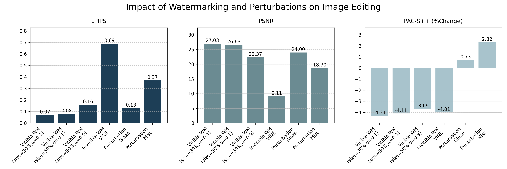

# Perturbation vs Watermark

Evaluate how **image protection methods** affect AI style-transfer / img2img quality.

This repo compares:

| Category | Methods |
|---|---|
| Perturbation defenses | Glaze, Mist (and similar) |
| Watermarks | Visible overlays (size / opacity variants), invisible watermark (VINE) |

Goal: measure the trade-off between **visual quality of the protected image** (LPIPS, PSNR) and **disruption of downstream generation** (CLIP / PAC-S++ image–text alignment).

Example result plots are in [`plots/`](plots/).



## Metrics

- **LPIPS** / **PSNR** — perceptual / pixel similarity between original and protected inputs (or generations).
- **CLIP score** / **PAC-S++** — image–text alignment of generations under a style-transfer prompt (e.g. “change to style to Picasso”).
- **Percentage change** (`PerChang.py`) — relative drop/rise of CLIP & PAC between clean vs protected generations.

## Scripts

| File | Role |
|---|---|
| `CP_scores.py` | CLIP / PAC-S++ scoring helpers |
| `PerChang.py` | Mean **percentage change** of CLIP/PAC (needs caption JSON) |
| `PerChang1.py` | Mean **absolute** CLIP/PAC on paired image folders |
| `lpips_sim.py` | Mean LPIPS between two image folders |
| `psnr_sim.py` | Mean PSNR between two image folders |
| `create_mix.py` | Mix several watermark-strength folders into one |
| `visual.py` | Re-plot summary bar charts into `plots/` |
| `act.sh` | Example: percentage-change eval |
| `run.sh` | Example: absolute ITA eval |

## Setup

```bash
pip install -r requirements.txt
```

You also need:

- A GPU + CUDA-capable PyTorch
- OpenAI CLIP (`pip` installs `clip` via `git+https://github.com/openai/CLIP.git` in requirements)
- PAC-S++ checkpoint `PAC++_clip_ViT-L-14.pth` ([PACScore](https://github.com/aimagelab/pacscore))

## Usage

Edit paths in the example shells, or call scripts directly:

```bash
# Percentage change: clean gens vs protected gens
python PerChang.py --device cuda:0 \
  --caption_path /path/to/captions.json \
  --PACcheckpoint /path/to/PAC++_clip_ViT-L-14.pth \
  --ori_dataset_path /path/to/clean_generations \
  --adv_dataset_path /path/to/protected_generations

# Absolute CLIP/PAC on folder pairs
python PerChang1.py --device cuda:0 \
  --PACcheckpoint /path/to/PAC++_clip_ViT-L-14.pth \
  --ori_dataset_path /path/to/reference \
  --adv_dataset_path /path/to/protected

# Perceptual similarity
python lpips_sim.py --device cuda:0 \
  --data1_path /path/to/a --data2_path /path/to/b
python psnr_sim.py \
  --data1_path /path/to/a --data2_path /path/to/b
```

Caption JSON for `PerChang.py` is a list of objects with at least `Img` and `transfer_style` fields. Generation filenames are expected as `{seed}_{transfer_style}_{Img}`.

## Expected data layout

```
data/
  input/          # original / protected artworks
  generation/     # img2img outputs from those inputs
captions.json     # style-transfer metadata
PAC++_clip_ViT-L-14.pth
```

## Citation

If you use this code, please cite us:

```bibtex
@inproceedings{tang2025watermarks,
  title={Watermarks vs. Perturbations for Preventing {AI}-based Style Editing},
  author={Qiuyu Tang and Aparna Bharati},
  booktitle={The 1st Workshop on GenAI Watermarking},
  year={2025},
  url={https://openreview.net/forum?id=mRCXybDMF6}
}
```

## License

Evaluation code only; third-party models (CLIP, PAC-S++, Glaze, Mist, VINE, etc.) keep their own licenses.
